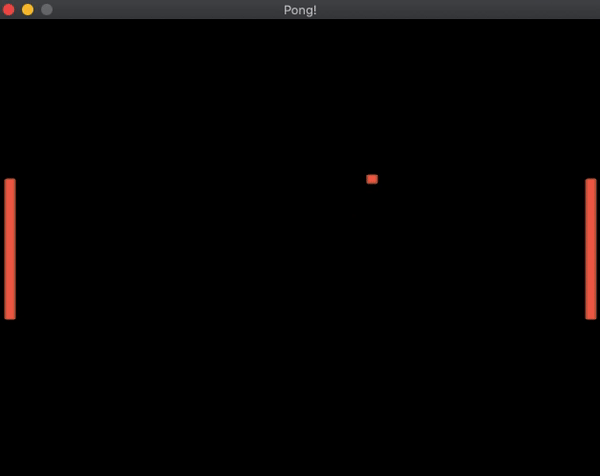

# Pong Game

This is an implementation of the classic Pong game using C++ and OpenGL.

## Controls

- Player 1 uses `W` (up) and `S` (down) keys.
- Player 2 uses `Up` and `Down` arrow keys.
- Press `Space` to start the game.
- The first player to score 3 points wins.

## Demo

## Technologies Used

- **C++**: The main programming language used for the game logic.
- **OpenGL**: Used for rendering the game graphics.
- **SDL**: Used for handling user input and window management.
